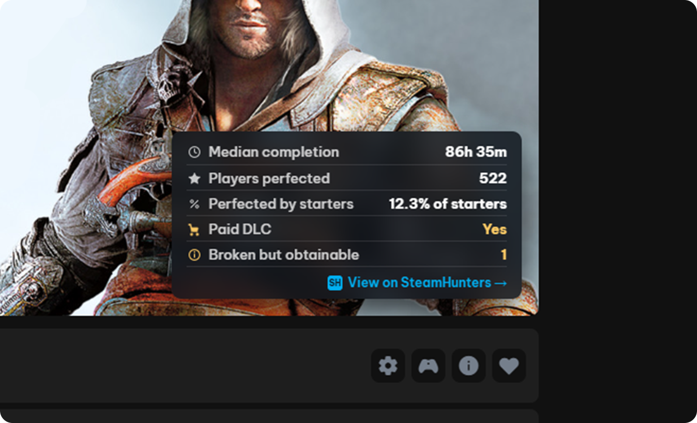
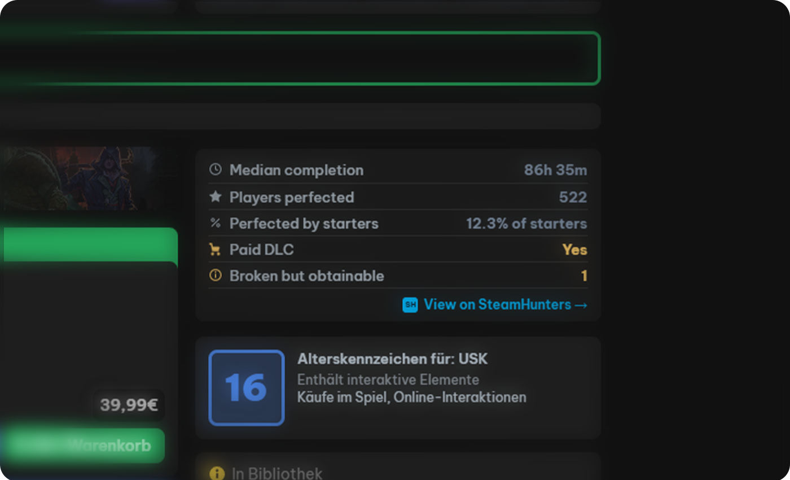

# Steam Completion Companion

A Millennium plugin that displays SteamHunters completion data inside Steam.

---

## Features

- Median completion time  
- Players perfected  
- Completion rate (starters → perfected)  
- Paid DLC indicator  
- Restricted status  
- Broken / conditional / unobtainable achievements  

---

## Library



Adds a floating panel to the Library app view.

- Matches Steam UI styling  
- Position and offset configurable  
- Updates on app change  

---

## Store



Adds a panel to Store pages near the game details.

- Inline layout  
- Minimal footprint  

---

## Settings

- Toggle Library / Store panels  
- Adjust position and offsets  
- Control visible data rows  

---

## Structure

```

backend/     API + caching
frontend/    Library panel + settings
webkit/      Store integration
shared/      Types and utilities

```

---

## Notes

- Only shown for games with achievements  
- Data is cached to reduce API usage  

---

## License

MIT