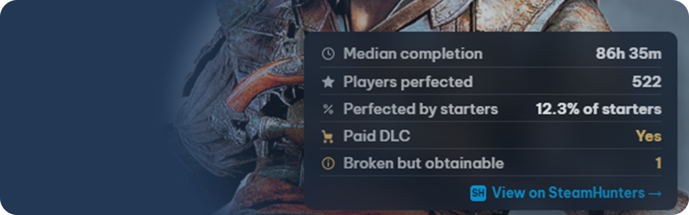

# Steam Completion Companion

A Millennium plugin that displays SteamHunters completion data inside Steam.

---

## Features

- Median completion time  
- Players perfected  
- Completion rate (starters → perfected)  
- Paid DLC indicator  
- Restricted status  
- Broken / conditional / unobtainable achievements  

---

## Requirements

- Steam with [Millennium](https://steambrew.app/) installed
- Internet connection for SteamHunters API requests

---

## Installation

### Via Millennium (recommended)

> Note: Submission is still pending.

1. Open the plugin browser: https://steambrew.app/plugins  
2. Find **Steam Completion Companion**  
3. Click **Copy Plugin ID**  
4. In Steam:  
   `Steam → Millennium → Plugins → Install a plugin`  
5. Paste the ID and install  

### For development or manual testing:

```bash
git clone https://github.com/sondermusik/steam-completion-companion.git
cd steam-completion-companion
pnpm install
pnpm dev
```

After building, move or symlink the project folder into your Millennium plugins directory.

---

## Library


Adds a floating panel to the Library app view.

- Matches Steam UI styling  
- Position and offset configurable  
- Updates on app change  

---

## Store


Adds a panel to Store pages near the game details.

- Inline layout  
- Minimal footprint  

---

## Settings

- Toggle Library / Store panels  
- Adjust position and offsets  
- Control visible data rows  

---

## Notes

- Only shown for games with achievements  
- Data is cached to reduce API usage  

---

## Structure

```

backend/     API + caching
frontend/    Library panel + settings
webkit/      Store integration
shared/      Types and utilities

```

---

## License

MIT